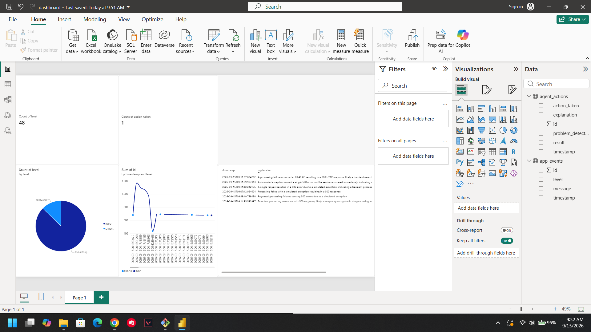

# Agentic DevOps Copilot

An autonomous AI agent that monitors a live application, diagnoses failures in natural language, takes corrective action (auto-restart), and surfaces everything in a Power BI dashboard — built end-to-end on free-tier tools.

## What this project demonstrates

Most "AI chatbot" portfolio projects stop at answering questions. This one closes the loop: an LLM-powered agent **observes real system logs, decides whether something is wrong, and acts on that decision autonomously** — then every observation and action becomes analytics-ready data.

It combines three skill areas that are usually shown separately:
- **Agentic AI** — an agent that reasons over unstructured logs and makes autonomous decisions, not just a prompt/response wrapper
- **DevOps** — containerization, CI/CD, and automated incident response
- **Analytics / BI** — the agent's own behavior becomes a Power BI dashboard, not an afterthought

## Architecture

```
Flask app (Docker container)
      │  writes
      ▼
app_logs.txt  ──parse_logs.py──▶  SQLite (app_events)
      │
      ▼
agent.py  ──Groq LLM (openai/gpt-oss-20b)──▶  diagnosis (JSON)
      │
      ├─▶ if "restart_service": docker restart <container>
      │
      └─▶ writes decision + action ──▶  SQLite (agent_actions)
                                              │
                                              ▼
                                     Power BI Dashboard
```

**Loop:** Observe (logs) → Diagnose (LLM) → Decide (structured JSON) → Act (restart) → Log (SQLite) → Visualize (Power BI)

## Tech stack

| Layer | Tool |
|---|---|
| Application | Python (Flask) |
| Containerization | Docker |
| CI/CD | GitHub Actions |
| Agentic AI | Groq API (`openai/gpt-oss-20b`) |
| Data storage | SQLite |
| Analytics | Power BI Desktop (via ODBC) |

Every tool here is free-tier — no cloud spend required to run or reproduce this project.

## What the agent actually does

1. Reads the last 20 lines of the application's log file
2. Sends them to an LLM with a structured prompt asking it to return JSON: whether a problem exists, why, and what action to take
3. Parses that JSON and acts on it — currently supports `restart_service` (restarts the Docker container) or `no_action`
4. Logs every decision — timestamp, explanation, action taken, result — to both a flat log file and a SQLite database

This is the core "agentic" piece: the LLM isn't just summarizing text, it's making an operational decision that triggers a real side effect.

## Dashboard



The dashboard tracks:
- **Total incidents detected** — count of ERROR-level events
- **Autonomous restarts triggered** — count of times the agent took corrective action on its own
- **Success vs failure rate** — INFO/ERROR breakdown
- **Events over time** — incident trend line
- **AI agent decision log** — a live table of every diagnosis and action the agent has taken, in its own words

## Running it locally

```bash
# 1. Clone and enter the repo
git clone https://github.com/arpit382/agentic-devops-copilot.git
cd agentic-devops-copilot

# 2. Add your Groq API key
echo "GROQ_API_KEY=your_key_here" > .env

# 3. Build and run the app in Docker
docker build -t devops-agent-app .
docker run -p 5000:5000 --name devops-agent-container -v "$(pwd -W)":/app devops-agent-app

# 4. In a separate terminal, generate some traffic
# (hit http://localhost:5000/process a bunch of times in your browser)

# 5. Set up the database and load the logs
python db_setup.py
python parse_logs.py

# 6. Run the agent
python agent.py
```

To view the dashboard, open `dashboard.pbix` in Power BI Desktop (requires a SQLite ODBC driver — see below) and hit Refresh.

<details>
<summary>Power BI SQLite setup (one-time)</summary>

1. Install the [SQLite ODBC driver](http://www.ch-werner.de/sqliteodbc/)
2. Open **ODBC Data Sources (64-bit)** → User DSN → Add → SQLite3 ODBC Driver
3. Name it `devops_agent_db`, point it at `devops_agent.db`
4. In Power BI: Get Data → ODBC → select `devops_agent_db`

</details>

## What I'd do next in production

This project intentionally stays local/free-tier for portfolio purposes. In a real deployment, the next steps would be:
- Replace the simulated failure endpoint with real application metrics (Azure Monitor / App Insights)
- Expand the agent's action set beyond restart (scale, rollback, page an on-call engineer)
- Move the SQLite layer to a proper warehouse (Azure SQL / Fabric) for multi-instance monitoring
- Add guardrails around autonomous actions — approval thresholds, rate limiting, rollback safety
- Publish the Power BI report to the Power BI Service for live, shareable dashboards

## Project background

Built as a one-month portfolio project to demonstrate agentic AI, DevOps automation, and BI in a single cohesive system — combining hands-on experience with Azure, Microsoft Fabric, and Power BI with a new agentic AI layer.
